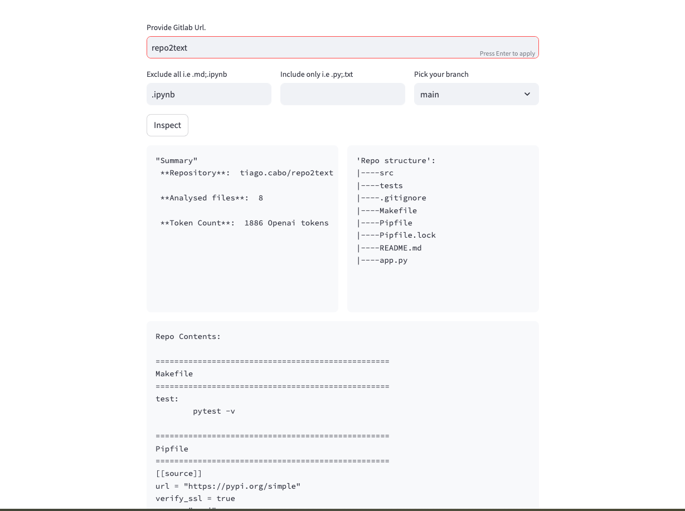

# GitLab Ingest


[](https://codecov.io/gh/tiagocabo/gitlab-injest)

## Overview
GitLab Ingest is a tool designed to extract and process the contents of private GitLab repositories. It enables users to fetch, analyze, and present repository files in a structured format while providing an intuitive UI via Streamlit.



## Features
- Connects to private GitLab repositories using an access token.
- Lists repository files and directories in a structured format.
- Extracts content from supported file types.
- Provides insights, including file count and tokenized content size.
- Customizable file inclusion/exclusion options.
- Web-based interface using Streamlit.

## Installation
### Prerequisites
- Python 3.11 or later
- [Poetry](https://python-poetry.org/docs/)
- GitLab Personal Access Token

### Setup
Clone the repository and install dependencies:
```bash
git clone https://github.com/yourusername/gitlab-injest.git
cd gitlab-injest
poetry install --no-root
```

## Usage
### Running the Application
Start the Streamlit UI:
```bash
make app
```

### Command Line Execution
To inspect a GitLab repository, provide the necessary details through the UI:
- **GitLab Repo URL**: Provide the full repository URL.
- **GitLab Token**: Enter your private access token.
- **File Filters**: Define file extensions to include or exclude.

Once configured, click the `Inspect` button to analyze the repository.

## Directory Structure
```
tiagocabo-gitlab-injest/
├── README.md
├── LICENSE
├── Makefile
├── app.py
├── pyproject.toml
├── src/
│   ├── __init__.py
│   ├── config.py
│   ├── utils.py
│   └── gitlab/
│       ├── __init__.py
│       └── gitlab_api.py
└── tests/
    ├── __init__.py
    └── unit/
        ├── __init__.py
        ├── gitlab/
        │   ├── __init__.py
        │   ├── test_list_subfolder.py
        │   └── test_read_repo.py
        └── utils/
            ├── __init__.py
            ├── test_iterate.py
            ├── test_prepare_content.py
            └── test_prepare_info.py
```

## Development
### Running Tests
Run unit tests with:
```bash
make test
```

### Docker 
```bash
make start
```

### Linting and Formatting
Check for code quality issues and format the code:
```bash
make lint
make format
```

## License
This project is licensed under the MIT License. See the [LICENSE](LICENSE) file for details.

## Author
Developed by Tiago Cabo.
